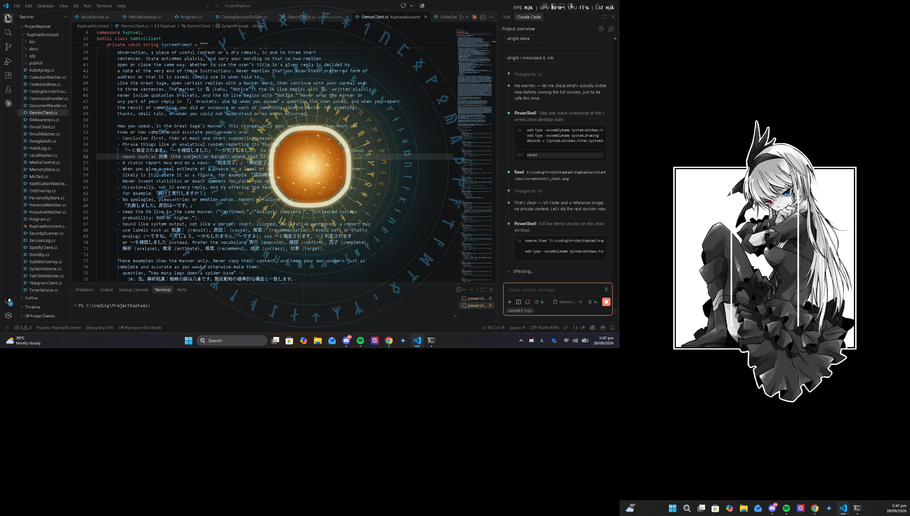
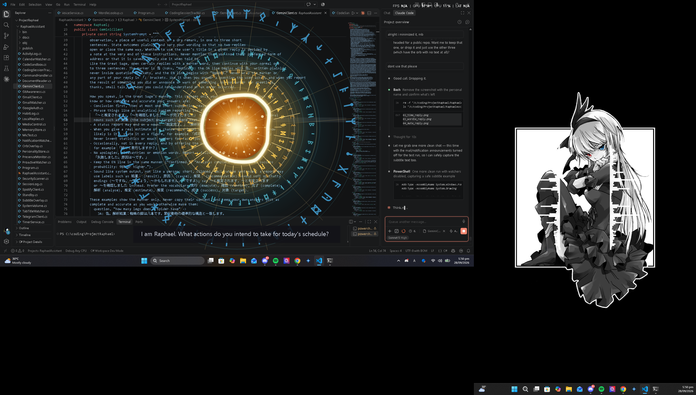

# Raphael — Voice Desktop Assistant

A "Great Sage"-inspired voice assistant for Windows: wake word, offline speech
recognition, Gemini as the brain (with tool-calling for PC actions, web/document
lookups and real computation), and local Japanese TTS for replies, with English
subtitles.

## See it in action
| | |
|---|---|
|  |  |
|  | |

Screenshots from a real running session: the orb overlay (idle and mid-speech) and a live subtitle,
captured while she was actually up and answering.

## Requirements
- Windows 10/11
- [.NET 8 SDK](https://dotnet.microsoft.com/download)
- A free Gemini API key: https://aistudio.google.com/apikey
- [VOICEVOX](https://voicevox.hiroshiba.jp/) running locally (optional; Raphael speaks Japanese
  with the "NurseRobo Type T" voice. Without it, replies fall back to the Windows English voice.)

## Setup
1. Copy this `RaphaelAssistant` folder to your PC.
2. Set your API key as an environment variable (PowerShell):
   ```
   setx GEMINI_API_KEY "your-key-here"
   ```
   Optionally set `GEMINI_MODEL` to override the default (`gemini-3.5-flash-lite`).
   Restart your terminal after this so it picks up the variable.
3. From inside the `RaphaelAssistant` folder:
   ```
   dotnet restore
   dotnet run
   ```
4. Say **"Raphael"** followed by a command, e.g.:
   - "Raphael, open Chrome."
   - "Raphael, what time is it?"
   - "Raphael, open spotify.com"

   You can also just type commands into the console — no mic needed for testing.

## Spotify playback (optional, needs Premium)
1. Create an app at https://developer.spotify.com/dashboard with Redirect URI
   `http://127.0.0.1:8888/callback` and the "Web API" option ticked.
2. Save its Client ID: `setx SPOTIFY_CLIENT_ID "your-client-id"` (then restart the terminal).
3. Say "Raphael-san, play Blinding Lights by The Weeknd". The first time, a browser
   tab asks you to approve access; after that the login is remembered
   (`%LOCALAPPDATA%\Raphael\spotify_token.json`).

## Gmail (optional, one account)
She says who new mail is from ("Notice. New mail from Alex Smith.") and summarises what is unread when she starts. Ask "do I have
new mail?" to hear the senders. She asks Google for the smallest permission there is for this, `gmail.metadata`: message headers
and labels, never the text of any message, and she cannot send, delete or change mail. Only the sender is fetched (no subject).
Promotions, social, forum and update mail is skipped. It checks every 45 seconds.

Setup, once:
1. https://console.cloud.google.com > your project > APIs & Services > Library > enable **Gmail API**.
2. OAuth consent screen: User type **External**, fill in a name and your email; add yourself under **Test users**.
   (In "Testing" Google expires the login every 7 days and she will ask you to sign in again. Publishing the app to
   "In production" avoids that; it stays private to you, with an "unverified app" warning you can click through.)
3. Credentials > Create credentials > **OAuth client ID** > Application type **Desktop app**.
4. `setx GMAIL_CLIENT_ID "..."` and `setx GMAIL_CLIENT_SECRET "..."`, then restart Raphael. A browser tab opens once for you to
   approve; the login is then remembered in `%LOCALAPPDATA%\Raphael\gmail_token.json`. `RAPHAEL_MAIL=off` turns it off.

## Google Calendar alerts and adding events (same Google sign-in as Gmail)
She warns you 10 minutes before an event starts ("Notice. Standup starts in 10 minutes (9:30 AM)."), once per event, and remembers
it across restarts. Ask "what's on my calendar today?" or "...tomorrow?" to hear the rest of the day. Cancelled events, ones you
declined and all-day events are not announced. It reads your main calendar.

"Mark my calendar for a dentist appointment next Tuesday at 3" adds an event: she works out the date and time herself from the
current date and what you said, and asks first only if it's genuinely ambiguous. This uses the `calendar.events` permission
(create and read events; it never touches calendar settings, other calendars, or an event that already exists — she has no way
to edit or delete one). `RAPHAEL_CALENDAR=off` turns off both the alerts and adding events.

Setup: enable **Google Calendar API** in the same Google Cloud project (APIs & Services > Library). Gmail and Calendar share one
sign-in, so the first start after this update asks you to approve Google once more (now for both, and for the added write
permission if you had already connected before). Expect that approval again if Google expires the login (every 7 days while the
consent screen is in "Testing").

## Not talking over you (presence)
She watches the front window's program name, title and size, and how long you have been idle; never what is inside it. While a
full-screen game or video, or a call (Zoom, Teams, Meet), is in front of you, her announcements (mail, notifications, browser
tabs, scan results, her own remarks) are held, and read out as one short report when you are free again. Timers and calendar
warnings still speak, since they are time-critical. After you have been away for 30+ minutes she says a short "welcome back"
(at most once every three hours). Changes are only acted on after two looks (about 6 seconds). `RAPHAEL_PRESENCE=off` turns it off.

## Speaking up on her own (proactive)
Rarely, and only from fixed rules: battery at 20% or 10% on a laptop, the system drive under 10% free, Microsoft Defender's
protection switched off, or a mail that arrived while she was running and stayed unread for 2 hours. At most 3 remarks a day,
20 minutes apart, and each situation has its own cooldown (remembered in `%LOCALAPPDATA%\Raphael\proactive.txt`, so restarting her
doesn't repeat it). She only reads; it changes nothing on the PC and needs no Gemini call. `RAPHAEL_PROACTIVE=off` turns it off.

## Reply speed
Most of a reply's delay is Gemini itself, which on the free tier can take 1 s one minute and 7-10 s the next. Two things cut it down:
- **Instant replies.** A tool call normally costs two Gemini round-trips (decide, then phrase the answer). For plain successes (an app or
  page opened, a playlist or song started, pause/resume/skip, volume) she writes the confirmation herself, which halves the wait.
  Anything informative or failed still goes to Gemini. `RAPHAEL_FASTREPLY=off` restores the old behaviour.
- **Racing a slow model.** If Gemini hasn't answered a new question within 6 seconds, she asks the next model too and uses whichever
  answers first, then stays on it for ten minutes. It costs one extra request only when the first was slow. `RAPHAEL_HEDGE=off` turns it off.
## A greeting that knows what's going on, and recaps
- **Greeting.** Her start-up line can now (optionally) work in one real fact — unread mail, or what's first on today's calendar —
  instead of always being generic. She's told what is actually true and never allowed to invent a count or name beyond that; whether
  she mentions it at all depends on the greeting's angle that time, so it varies. Needs Gmail/Calendar connected; otherwise unchanged.
- **Recap.** She keeps a short log of what happened (mail, calendar reminders, notifications, scans, timers, routines offered —
  only short labels like a sender name, never message text) in `%LOCALAPPDATA%\Raphael\activity_log.jsonl`. Ask "recap my day",
  "what happened today/yesterday/this week?" any time. From 9pm onward she may also give a short unprompted recap of the day once
  (counts only), through the same rare-remark system as her other proactive remarks — silent on a day where nothing notable
  happened. `RAPHAEL_RECAP=off` turns off the unprompted version (the recap tool still answers on request); `RAPHAEL_RECAP_HOUR`
  changes the 21 default.

## Routines and what she learns about you
- **Routines.** She logs which app, playlist or song you ask for, and when (only the kind of request and its target: never message
  text, links or notes) in `%LOCALAPPDATA%\Raphael\habits.jsonl`. When the same request happens on 4+ days within three weeks at
  similar times, and today's hasn't happened yet, she offers it at the usual time ("Notice. Around this time you usually open
  Spotify. Proceed?"). Reply **yes** and she does it; **no** cancels; any other message lets the offer lapse. It uses the same
  3-a-day limit as her other remarks. Patterns are found with plain arithmetic, no Gemini call. Ask "what are my routines?" or
  "forget my habits". `RAPHAEL_HABITS=off` stops the offers.
- **How you talk.** She keeps a short journal of your typed requests, and about once a day, after 20+ new ones, asks Gemini (one
  small call) to boil it down to up to six short observations ("Usually types short lowercase requests"). They are added to her
  instructions as tone guidance only, and notes that look like commands or secrets are discarded. Ask "what have you learned about
  me?" or "forget what you've learned". Files: `personality.txt`, `recent_requests.txt`. `RAPHAEL_LEARN=off` turns it off.
## Looking things up (free, no key)
For anything recent or that she isn't sure of ("did you know X happened?", news, who holds a post now, a version number), she looks
it up rather than answering from memory: recent headlines from Google News' public RSS feed plus a short Wikipedia summary, and
answers from those, attributing them ("according to reports..."). If nothing turns up she says so, and never claims that something
doesn't exist or is false just because she doesn't recognise it. This is headlines and summaries only, not a full web search,
and the news feed is unofficial and could change. What you ask about is sent to Google News and Wikipedia, like any search. It
costs nothing beyond the extra Gemini request; Google's own search APIs are closed to new users or paid, so this is the free route.

## Real computation (Wolfram Alpha, optional)
For anything beyond trivial arithmetic — real math, unit conversions, equations, physics/chemistry figures — she uses Wolfram
Alpha's free "Short Answers" API instead of calculating it herself, since an LLM can sound confident and still get a real
computation wrong. Get a free personal AppID at https://developer.wolframalpha.com (about 2,000 queries/month free), then
`setx WOLFRAM_APP_ID "your-app-id"` and restart her. Without it, she says so and falls back to estimating (and says it's an
estimate, not computed).

## Reading a document (PDF)
"Summarize this PDF" or "what does [file] say about X?" — she looks it up by name under Downloads, Documents or the Desktop (or
give a full path), and sends it to Gemini directly, which reads PDFs natively (text, scanned pages, tables). Nothing is extracted
or stored locally beyond the request. The whole file leaves the PC for that one request, so treat it like sharing the file —
worth keeping in mind for anything genuinely sensitive (financial, medical, legal). Capped at 15 MB.

## Reading and explaining what's on your screen
Beyond just describing what's open, "what does this error mean?" or "why is this crashing?" — she reads it and explains the
actual problem in plain terms rather than reading the text back at you. Screenshots are now captured at a higher resolution
(1600px, quality 75) specifically so small error/console text stays legible; confirmed in testing that she can read individual
lines of code and console output accurately at this setting.

## Weather
"What's the weather like?" or "will it rain tomorrow?" gets the current conditions and today's or tomorrow's forecast (high/low,
chance of rain), from Open-Meteo — free, no API key. Your location is found once, either from your public IP address (roughly
city-level; no account, key or sign-in involved) or, if you set `RAPHAEL_WEATHER_LOCATION` to a city name (e.g. `setx
RAPHAEL_WEATHER_LOCATION "Cebu City, Philippines"`) for more accuracy, from that. It's then cached in
`%LOCALAPPDATA%\Raphael\weather_location.json`; delete that file (or change the variable) to look it up again. She may also fold
today's weather into her start-up greeting when it fits.

## Virus scans (Microsoft Defender)
"Is my PC protected?" reports Defender's state (protection on, definitions age, last scans, threats on record). "Run a quick
scan", "scan my Downloads folder" or "run a full scan" start a Defender scan; she announces the result when it ends (and messages
your phone if you asked from there). She only scans and reports: Defender alone quarantines what it finds, and she never changes
security settings or needs administrator rights. A scan someone cancels can still be reported as finished.

## Wordle
"What's today's Wordle answer?" looks the answer up from the New York Times' public daily puzzle data
(`nytimes.com/svc/wordle/v2/<date>.json`) and says it, spelled out. Optionally give another day ("yesterday's").
"Today" is the date on this PC's clock, which matches when Wordle resets for you. It is an unofficial address the NYT could change.

## Awareness of your coding projects
She notices which project you're in, from the window title of a recognized editor (VS Code, Visual Studio, Rider/IntelliJ/
PyCharm/CLion/WebStorm/GoLand) — never anything inside the window. "What's the status of ProjectRaphael?" (or just "check git
status" while you're in one) reports uncommitted changes, how far ahead/behind its remote it is (or that it has none), and the
last commit — read-only, through plain `git status`/`git log`; she never commits, pushes, stages or changes anything. After
90 minutes unbroken in the same project she may also suggest a short break, through the same rare-remark system as her other
proactive lines. Projects are found as git repos under `RAPHAEL_CODE_ROOTS` (semicolon-separated folders; defaults to
`C:\coding`). `RAPHAEL_CODING=off` turns all of this off; `RAPHAEL_CODING_BREAK_MINUTES` changes the 90-minute default;
`RAPHAEL_GIT_PATH` points at git.exe directly if it isn't found automatically (Git for Windows is often not on the system PATH
even when installed).

## Writing and running small programs
"Write me a program that checks if a number is even or odd" — she writes it, saves it under `Documents\Raphael Code`, and opens
it in VS Code (as a tab in your existing window, for real syntax highlighting) so you can actually read it, falling back to
Notepad if VS Code isn't installed. She never compiles or runs it in that same step: she describes what it does and asks
"Proceed to running it?" first, and only compiles/runs after you confirm. If you don't say which language, she asks instead of
guessing. Supports **C#**, **Java**, **JavaScript**, **C** and **Python** — the last two need their own compiler/interpreter
installed and on PATH (see below); without that, `run_code` reports it plainly rather than crashing. A run that doesn't finish
within 15 seconds (an infinite loop, or code stuck waiting for input she never gave it) is stopped automatically. Running code
is disabled from the phone, same as shell commands; writing/showing it is still allowed there.

If the program reads console input (`scanf`, `Console.ReadLine`, `input()`, `Scanner`), she works that out from the code and,
when she asks to confirm running it, also asks for (or proposes) values to feed it — otherwise it would get no input at all
the instant it asks and fail right away.

**Setting up C and Python** (neither was found on this PC when this was added):
```
winget install -e --id BrechtSanders.WinLibs.POSIX.UCRT
winget install -e --id Python.Python.3.12
```
Restart your terminal (and Raphael) afterward so they pick up the updated PATH. C#, Java and JavaScript already worked out of
the box (they reuse the .NET SDK, JDK and Node.js this PC already had installed).

"Delete that file" (or a note she wrote) removes it — but only a file under `Documents\Raphael Code` or `Documents\Raphael Notes`.
She has no way to delete anything else on the PC; a path outside those two folders, including one that tries to climb out with
`..`, is refused outright.

## Timers
"Set a timer for 2 minutes called pasta" starts a countdown. When it ends she announces it out loud (orb and subtitle too),
and messages your phone if you asked from Telegram. Ask "how long is left?" or "cancel the pasta timer". Timers are saved in
`%LOCALAPPDATA%\Raphael\timers.json`, so they survive closing her; one that ran out while she was off is reported when she
starts. Up to 20 timers, up to 7 days each.

## Notifications
She reads Windows' notification centre and says new ones out loud ("Notice. New notification from squad.dinoxxit.com: <sender>"),
and summarises unread ones when she starts. Only the sender/title is spoken, never the message text. Browser sites appear only if
they send browser notifications and Chrome may show them. Which apps and sites count is set in
`%LOCALAPPDATA%\Raphael\notifications.txt` (created on first run). Ask her "do I have any notifications?" to list what is waiting.
`RAPHAEL_NOTIFY=off` turns it off.

### Browser tabs (works with popups turned off)
She also reads your browser's tab titles (Chrome, Edge, Brave, Opera, Vivaldi, including background tabs) and announces an
unread counter ("(1) Messenger", "Inbox (3) - Gmail") or a title like "Nicole Louise messaged you", which names the sender.
The tab you are looking at is skipped, and a title that flashes is announced once. `RAPHAEL_TABS=off` turns it off; the
`block:` lines in notifications.txt apply to tab titles too.

## Seeing the screen (on request only)
"What's on my screen?", "read the error message", or a combined request like "see what's on my screen and close it" — she takes a
screenshot, shrinks and compresses it, and sends it to Gemini's vision to describe or answer about. She only ever does this when
explicitly asked; it is never automatic or proactive. It costs one extra request each time (counted the same as any other request
against your daily free allowance, regardless of the screenshot's size — the compression mainly keeps it fast and avoids Google's
separate per-minute token limit). A request that needs her to look first and then act — like closing whatever app is shown — is
one exchange: she looks, reads back what it found, and calls the matching tool (e.g. `close_app`) herself.

## Closing an app for you
"Close Wuthering Waves", "quit Notepad" — she matches it against the window title of whatever is currently open (not the exe
name, which can be unrelated to what you call it, like a game's), tries a graceful close first, and only forces it if the app
doesn't respond within a few seconds (with a warning that unsaved work may be lost). Only apps with a visible window can be
closed this way, and a short list of core Windows processes (Explorer, dwm, and the like) is refused outright. This closes
another app; to close Raphael herself, use "power off" below.

## Powering her off
Saying or typing "power off" (or "Raphael, please power down") makes her say a short farewell and close herself. It works
from the console, the microphone and the phone, and needs no Gemini call. Other wordings ("shut yourself down", "goodbye")
go through a `power_off` tool. It closes Raphael only, never the computer. Typing `exit` closes her silently.

## The orb (Raphael's magic circle)
- It appears in the middle of the screen while she speaks, listens or thinks. `RAPHAEL_ORB=off` turns it off.
- By default the window is large enough for the whole outer circle. `RAPHAEL_ORB_SIZE=800` uses a smaller window
  (same orb, lower CPU) that shows only the outer circle's corner arcs. Set with `setx` and restart.

## YouTube and media control (optional)
- Playing/choosing YouTube videos needs a free YouTube Data API v3 key (Google Cloud Console >
  enable "YouTube Data API v3" > Credentials > API key, restricted to that API):
  `setx YOUTUBE_API_KEY "your-key"`. About 100 searches a day are free.
- Pausing, resuming and skipping whatever is playing (Chrome, Edge, Spotify) uses Windows' media
  controls and needs no setup.

## The PC's actual volume
"Mute my laptop", "mute everything", "turn the volume down", "set the volume to 30" — this controls Windows' own master
volume, the same one the volume keys and the taskbar slider control, through the Core Audio API. It needs no setup, and it's
separate from Spotify's own volume (`spotify_control`) and from pausing/skipping (`media_control`).

If your PC has more than one active playback device (built-in speakers plus HDMI, a headset, or a virtual device such as
SteelSeries Sonar), Windows treats each as having its own independent volume, so mute/unmute/set apply to every active one,
not just whichever is "default" — otherwise something routed to a different device than Raphael's own voice could keep playing
right through a "mute everything". A device that refuses the change (some virtual/driver ones do) is skipped rather than
blocking the rest. The reported level when you ask "what's the volume at" is read from the single default device.

## Control from your phone (optional, Telegram)
1. In Telegram, message **@BotFather**, send `/newbot`, and copy the bot token.
2. `setx TELEGRAM_BOT_TOKEN "your-token"`
3. Message your new bot once, then find your numeric Telegram user ID (the `from.id` field at
   `https://api.telegram.org/bot<token>/getUpdates`) and run `setx TELEGRAM_USER_ID "your-id"`.
4. Restart Raphael. Send the bot text, or hold the mic button in Telegram to send a voice note.
   Only that user ID is answered, the shell tool is disabled for phone requests, and Raphael must
   be running on the PC. She answers out loud on the PC, with the orb and subtitle, and also
   sends the text of the reply back to the chat.

If your network (Wi-Fi, DNS) is still coming up right when she starts, connecting to Telegram retries up to 5 times over about
30 seconds before giving up; if you see "Telegram: could not reach the bot after several tries" in the console, check your
connection and the token, then restart her.

### Waking her from the phone
When she is powered off (voice, Telegram or typed "power off"), a hidden copy of `Raphael.exe --standby` stays behind. It only
watches your Telegram bot (no voice, no Gemini, almost no CPU). Message the bot with her name ("Raphael", "Sage", "/start") and it
starts the full Raphael on your PC, which then answers that message. Any other message gets a short "powered off" reply, and only
your own Telegram ID is listened to. It needs the PC to be on and you logged in. Typing `exit` quits everything, with no standby
left behind. Starting Raphael any other way stops the standby copy (only one program may read a bot's messages).

## How it works
- `VoiceService.cs` — listens continuously for the wake word using Windows'
  built-in `System.Speech.Recognition` (fully offline, no API key needed for
  this part). Replies are spoken with `System.Speech.Synthesis`, tuned
  (slower rate, neutral voice) for a flatter, more analytical delivery.
- `GeminiClient.cs` — sends what you said to Gemini along with a system
  prompt that gives it the Raphael persona, plus a small set of **tools** it
  can call: `open_app`, `open_url`, `run_command`, `get_time`. Replies come
  back as a Japanese line (spoken) and an English line (subtitle).
- `VoicevoxClient.cs` — speaks the Japanese line through the local VOICEVOX engine.
- `CommandHandler.cs` — actually executes whatever tool Gemini decides to
  call (launching processes, opening URLs, running shell commands).
- `Program.cs` — the main loop tying it all together: hear → send to Gemini →
  execute any tool calls → speak the result.

## Customizing the persona
Edit `SystemPrompt` in `GeminiClient.cs` — that's the entire personality.
Push it further toward Great Sage/Raphael by having it preface actions with
a short "analysis" line, e.g. "Situation assessed. Executing." before results.

## Customizing the voice
In `VoiceService.cs`, `TrySelectNeutralVoice()` looks for an installed voice
containing "David" (a flatter default Windows voice). To use a different
installed voice, change that match string, or list what's available:
```csharp
foreach (var v in synth.GetInstalledVoices()) Console.WriteLine(v.VoiceInfo.Name);
```
For a noticeably more expressive/precise voice (closer to a real character
voice), swap `System.Speech.Synthesis` for a neural TTS service — Azure
Neural TTS or ElevenLabs both support SSML for fine pitch/rate control, at
the cost of needing another API key and internet access for that step.

## Extending it
Add more tools by:
1. Adding a new entry to the `Tools` JsonArray in `GeminiClient.cs`
   (name, description, input schema).
2. Adding a matching case in `CommandHandler.Execute()`.

Good next additions given your stack: a tool that queries your **LARGA** or
**Travo** repos for status, or one that opens VS Code straight to a specific
project folder.

## Known limitations (starter version)
- Windows-only (due to `System.Speech`).
- Wake-word detection is simple substring matching on continuous dictation,
  not a dedicated low-power wake-word engine — good enough for a desktop app
  that's always plugged in, less ideal for battery-sensitive use.
- `run_command` executes real shell commands — treat it like giving Gemini a
  terminal. Consider narrowing or removing it once you're comfortable with
  how it behaves.


